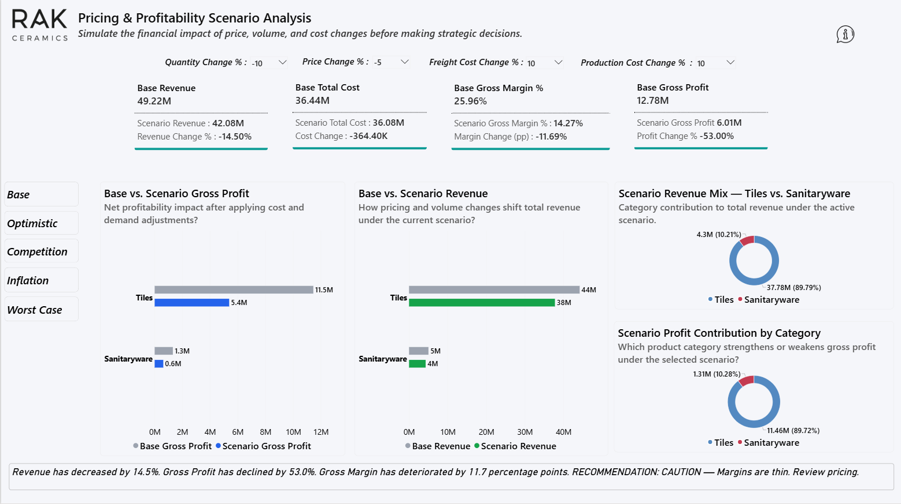
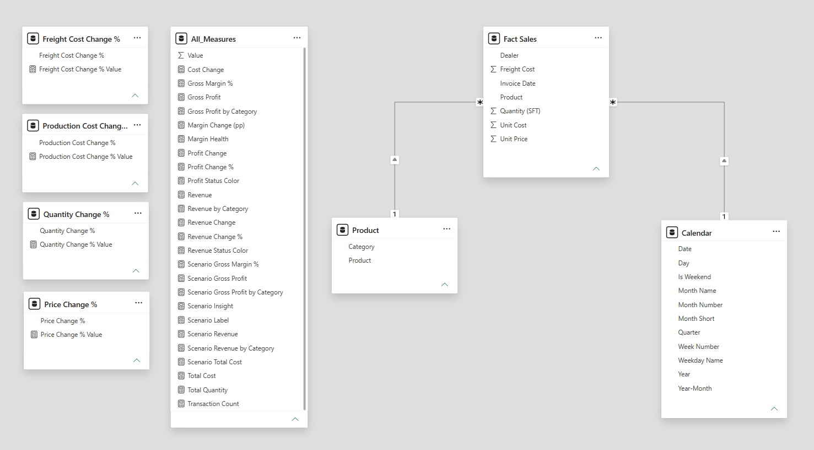

# 📊 Pricing & Profitability Scenario Analysis

> **Simulate the financial impact of price, volume, and cost changes before making strategic decisions.**


---

## 🖼️ Dashboard Preview



---

## 🧩 Problem Statement

Businesses often make pricing and cost decisions **without knowing the downstream impact on gross margin**. A 5% price cut might seem small — but combined with rising freight costs and volume uncertainty, it can erode profitability significantly.

This Power BI dashboard lets decision-makers **test scenarios interactively before committing** — no spreadsheet needed, no finance team required for a quick what-if.

---

## ✅ What It Does

| Feature | Description |
|---|---|
| 🎛️ **4 What-If Slicers** | Adjust Price %, Quantity %, Freight Cost %, Production Cost % in real time |
| 📊 **Base vs Scenario Comparison** | See Revenue, Cost, Gross Profit and Margin % side by side |
| 🏷️ **Margin Health Classification** | Strong / Acceptable / Weak / Critical — auto-calculated |
| 💬 **Plain-Language Recommendation** | DAX-generated insight text: Favorable / Caution / Unfavorable |
| 🔘 **5 Pre-Built Scenario Buttons** | Base · Optimistic · Competition · Inflation · Worst Case |
| 🍩 **Category Mix View** | Tiles vs Sanitaryware revenue and profit split under each scenario |

---

## 🗂️ Data Model


| Table | Type | Key Columns |
|---|---|---|
| `Fact Sales` | Fact | Invoice Date · Dealer · Product · Quantity (SFT) · Unit Price · Unit Cost · Freight Cost |
| `Product` | Dimension | Product · Category (Tiles / Sanitaryware) |
| `Calendar` | Date dimension | Date · Month · Quarter · Year |
| `Price Change %` | What-if parameter | Slicer −20% to +20% |
| `Quantity Change %` | What-if parameter | Slicer −30% to +30% |
| `Production Cost Change %` | What-if parameter | Slicer −20% to +20% |
| `Freight Cost Change %` | What-if parameter | Slicer −20% to +20% |

---

## 🧮 Key DAX Measures

### Core scenario logic

```dax
-- Scenario Revenue
Scenario Revenue =
SUMX(
    'Fact Sales',
    'Fact Sales'[Quantity (SFT)]
        * ( 1 + [Quantity Change % Value] / 100 )
        * 'Fact Sales'[Unit Price]
        * ( 1 + [Price Change % Value] / 100 )
)

-- Scenario Gross Margin %
Scenario Gross Margin % =
DIVIDE( [Scenario Gross Profit], [Scenario Revenue], 0 )

-- Margin Health classification
Margin Health =
SWITCH(
    TRUE(),
    [Scenario Gross Margin %] >= 0.28, "Strong",
    [Scenario Gross Margin %] >= 0.20, "Acceptable",
    [Scenario Gross Margin %] >= 0.10, "Weak",
    "Critical"
)
```

> 📁 All measure expressions are available individually in the [`/dax`](./dax/) folder.

---

## 📁 Repository Structure

```
📁 pricing-scenario-analysis/
├── 📄 README.md
├── 📁 report/
│   └── Scenario_Analysis.pbix
├── 📁 data/
│   └── sample_data.xlsx          ← simulated data (ChatGPT-generated)
├── 📁 docs/
│   └── dashboard_screenshot.png
└── 📁 dax/
    ├── scenario_revenue.dax
    ├── scenario_total_cost.dax
    ├── scenario_gross_profit.dax
    ├── scenario_gross_margin.dax
    ├── margin_health.dax
    └── scenario_insight.dax
```

---

## 🔌 Connecting Real Data

This project was built on **simulated data** generated for demonstration purposes. The model is structured to connect to live data with **zero DAX changes**.

### What to replace

| Current | Replace with |
|---|---|
| `sample_data.xlsx` in `Fact Sales` | ERP / SAP sales export · same column structure |
| Simulated Unit Price / Unit Cost | Actual invoice-level pricing and cost data |
| Simulated Freight Cost | Actual logistics cost per shipment |

### What becomes possible with real data

```
💰 Pricing floor per dealer    → know exactly when margin turns Critical
🚚 Freight contract ceiling    → hard number before logistics negotiations
🤝 Volume deal evaluation      → price cut vs volume gain, instant profit answer
📦 Category mix strategy       → which division to push volume in per scenario
⚠️  Inflation stress test       → board-ready numbers before next price revision
```

---

## 🧠 Business Decisions This Enables

**Scenario: A dealer asks for −10% price in exchange for +25% volume**
→ Set Price Change % = −10, Quantity Change % = +25
→ Dashboard instantly shows whether the deal improves or destroys gross profit

**Scenario: Freight costs rise by 15% due to fuel prices**
→ Set Freight Cost Change % = +15
→ See exactly how many margin points are lost — and what price increase recovers them

**Scenario: Board wants worst-case margin before year-end planning**
→ Click "Worst Case" bookmark
→ Scenario Insight generates a plain-language recommendation automatically

---

## 🛠️ Tech Stack


- **Power BI Desktop** — report canvas, bookmarks, what-if parameters
- **DAX** — 28 measures across scenario logic, classification and insight generation
- **What-If Parameters** — disconnected tables driving slicer-to-measure flow
- **Bookmarks** — pre-built scenario navigation (Base / Optimistic / Competition / Inflation / Worst Case)

---

## 👤 Author

**Rakib Ahmed**
BI Analyst · RAK Ceramics BD Limited · Dhaka, Bangladesh

[](https://linkedin.com/in/rkahmed)
[](https://github.com/Rk-ahmed)

---

## 📄 License

This project is licensed under the MIT License. The dataset is fully synthetic — no real business data is included.
